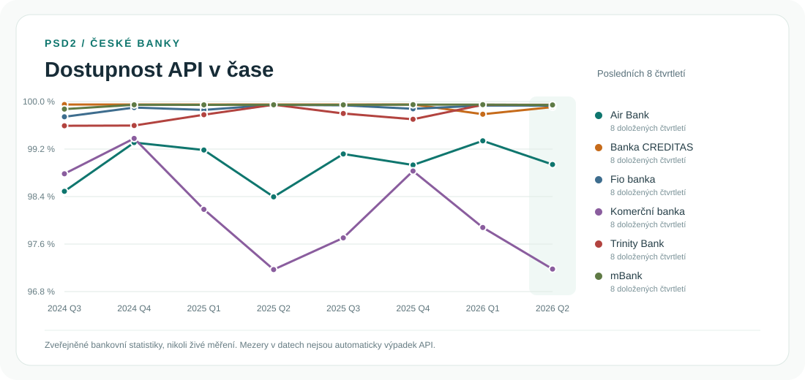

# API PSD2 tracker

Automatický přehled zveřejňované dostupnosti a výkonu PSD2 rozhraní českých bank. Tracker sleduje **to, co banky samy publikují** podle čl. 32 odst. 4 regulatorních technických standardů PSD2. Neměří živé produkční API vlastním voláním, protože to by bez TPP certifikátu a korektního testovacího scénáře dávalo zavádějící výsledky.

Kontrola běží každé úterý pomocí GitHub Actions a také ručně přes `Actions → Aktualizace PSD2 trackeru → Run workflow`. Banky publikují povinné statistiky čtvrtletně, ale ne ve stejný den; týdenní kontrola zachytí nový report rychle a přitom jejich weby nezatěžuje.

## Vývoj v čase

Na výslovnou žádost jsou od 17. září 2026 do statistik a dashboardu zahrnuty také **souhrnné reporty mBank**, s trvale viditelným označením **„Souhrnný report · samostatný český rozsah nepotvrzen“**. Z 28 uchovaných PDF přibylo **29 čtvrtletních souhrnů a 2 574 denních záznamů od 14. 6. 2019 do 30. 6. 2026**; první dokument zasahuje do dvou čtvrtletí. Aktuální historie tak obsahuje **224 bankovních čtvrtletních záznamů a 19 893 denních záznamů**. Číselné hodnoty ostatních bank ani původní Excel se nezměnily. Dostupnost, odezvy AIS/PIS a společná chybovost API jsou převzaty z denních tabulek a agregovány podle popsané metodiky; samostatná dostupnost/chybovost AISP a PISP se nedomýšlí. Nejde o nově ověřený samostatný český výřez. [Rozsah, metodika a kontrola importu](docs/mbank-summary-import-2026-09-17.md).

[Další přezkum všech 15 bank](docs/source-recheck-2026-09-16.md) doplnil evidenci **28 veřejných reportů mBank** (EN/PL varianta českého portálu) a produkčního reportu Oberbank s neověřeným českým rozsahem. Nejde o banky bez zveřejněných dokumentů; jejich čísla ale nejsou vydávána za samostatná česká data. Původních **194 čtvrtletních záznamů** i **17 319 denních záznamů** zůstalo beze změny. Nově přibyl **1 označený výpočet MONETY za 2Q2026 z 13/91 dnů**, celkem 195 záznamů. Výpočty uzavřených čtvrtletí se při týdenním sběru přepočítávají z uchovaného archivu, nikoli jen z živého 90denního okna. Přehled reportů se otevírá na nejnovějším období vpravo; legenda vyjadřuje doložené denní pokrytí souhrnných metrik, ne pouhou existenci uptime metriky.



Graf se při týdenní aktualizaci obnovuje automaticky. Zobrazuje jen banky s doloženými reporty; chybějící čtvrtletí nepřemosťuje. Podrobnější interaktivní přehled, přepínání metrik, pokrytí zdroji a odkazy na jednotlivé reporty je připravený pro GitHub Pages na adrese `https://tesskosnar.github.io/API-PSD2-tracker/`.

Dashboard zahrnuje všech 15 bank z původního sešitu. Opakovaná kontrola 16. září 2026 rozšířila historii na **194 bankovních čtvrtletních záznamů: 189 s číselným čtvrtletním souhrnem, 4 reporty PPF bez aktivních volání a 1 sporný report bez převzatých čísel**, celkem **17 319 denních záznamů za 13 bank** od roku 2019. Nově je doplněno 20 použitelných čtvrtletí Raiffeisenbank; report označený 3Q2025 má denní datumy 2024 a zůstává jen jako zdrojový doklad. [Nová kontrola všech 15 bank](docs/re-audit-2026-09-16.md) porovnává výsledek s předchozí verzí. Původních 173 čtvrtletních záznamů se při tomto dohledávání nezměnilo. Čtvrtletní srovnání ve výchozím stavu ukazuje poslední dva roky; rozsah lze upravit dvěma posuvníky nebo rychlou volbou. Banky s alespoň jednou hodnotou vybrané metriky ve zvoleném období jsou nejdříve abecedně; banky bez hodnot jsou za viditelným předělem také abecedně. Samotná existence reportu nestačí k zařazení mezi vyplněné řádky. [Porovnání s původním Excelem](docs/original-data-comparison.md) a [přesný seznam starších oprav](docs/historical-data-corrections.csv) vysvětlují dřívější rozdíly.

GitHub Pages je nutné jednou povolit v `Settings → Pages → Source: GitHub Actions`. Publikace se potom obnoví po každém úspěšném běhu týdenního trackeru a lze ji spustit také ručně v `Actions → Publikace dashboardu na GitHub Pages`.

Přehled nabízí režimy **Stejné čtvrtletí** a **Nejnovější údaje**. Ve druhém jsou starší reporty, pohyblivé přehledy a doplňkový Partners health-check oddělené skupiny; řazení metrik probíhá uvnitř skupin. Dostupnost AISP/PISP má samostatné volby a ze souhrnné hodnoty se neodvozuje. Tři odstíny zelené se počítají podle mediánu celé doložené čtvrtletní historie dané metriky: střední pásmo je medián ± medián absolutních odchylek (MAD), tmavá zelená označuje lepší hodnoty mimo pásmo, střední zelená pásmo kolem mediánu a světlá zelená horší hodnoty. U odezvy/chybovosti je lepší nižší číslo, u dostupnosti vyšší. Prázdné hodnoty zůstávají šedé a nezapočítávají se, publikované nuly ano; při nulovém MAD je střední pásmo přesně na mediánu. Barvy se nemění posunem období ani výběrem bank a nejsou SLA ani regulatorní limity. Doplněná historie přirozeně mění podklad pro medián, nikoli pravidlo výpočtu. Kliknutí na banku otevře její čtvrtletní i denní historii; kliknutí na report ukáže metriky, počet archivovaných dnů a omezení. Odkaz pro sdílení obnovuje výběr a exportuje se právě zvolené období, banky a metrika. Počet archivovaných dnů není potvrzením úplnosti měření banky.

> **Soukromí:** GitHub Pages je veřejně dostupný web i tehdy, když zdrojový repozitář zůstane soukromý. Zapnutí Pages proto znamená zveřejnění dashboardu a dat, která zobrazuje.

<!-- TRACKER:START -->
Očekávané poslední zveřejněné období: **2026-Q2** (po 45denní lhůtě na publikaci).

Souhrn hlavního seznamu: **7 s aktuální dostupností**, **3 s částečnými daty**, **2 zastaralé**, **0 bez nalezeného reportu**, **1 blokováno**. **2 s neověřeným českým rozsahem reportu**.

| Banka | Stav | Poslední období | Dostupnost | Odezva AISP / PISP | Zdroj |
|---|---|---:|---:|---:|---|
| Česká spořitelna | OK | 2026-Q2 | AISP 99.5523 % / PISP 99.2837 % | — / — | [stránka](https://developers.erstegroup.com/api-health-check/bank.csas/last-quarter) |
| ČSOB | Částečná data | 2026-Q2 | — | 879.2395 ms / 612.5572 ms | [stránka](https://www.csob.cz/csob/otevrene-bankovnictvi-csob/pro-vyvojare/seznam-api/reporting) · [report](https://www.csob.cz/documents/10710/21871290/psd2-q2-2026.xlsx) |
| Komerční banka | OK | 2026-Q2 | 97.1856 % | 378.5604 ms / 408.4945 ms | [stránka](https://www.kb.cz/cs/dostupnost-sluzeb-internetoveho-a-otevreneho-bankovnictvi-api) · [report](https://www.kb.cz/getmedia/956647de-9725-4cf0-9975-52c1e3462491/kb-psd2-2026-q2-cz.pdf) |
| Raiffeisenbank | Zastaralé | 2025-Q1 | AISP 99.9981 % / PISP 100 % | — / — | [stránka](https://www.rb.cz/informacni-servis/dokumenty-ke-stazeni) · [report](https://www.rb.cz/attachments/infopovinnost/statistiky-vykonu-rozhrani-otevreneho-bankovnictvi-1Q-2025.pdf) |
| Air Bank | OK | 2026-Q2 | 98.9736 % | 62.8242 ms / 72.7143 ms | [stránka](https://www.airbank.cz/aplikace-tretich-stran/) · [report](https://www.airbank.cz/file-download/statistiky-dostupnosti-2q-2026) |
| MONETA Money Bank | Částečná data | rolling-90d-to-2026-09-15 | — | 498.5111 ms / 149.3667 ms | [stránka](https://www.moneta.cz/otevrene-bankovnictvi) |
| Fio banka | OK | 2026-Q2 | 99.9809 % | 22.7143 ms / 16 ms | [stránka](https://developers.fio.cz/stats.html) · [report](https://developers.fio.cz/stats/PSD2_2026Q2.pdf) |
| mBank | Český rozsah neověřen | 2026-Q2 | 99.9929 % | 392.6154 ms / 327.9451 ms | [stránka](https://developer.api.mbank.cz/reports) · [report](https://dpprodassetstorage.blob.core.windows.net/prod-asset-storage-container/1d57afe69deb4b25a25aac9487a31605.pdf) |
| UniCredit Bank | OK | 2026-Q2 | 100 % | 345.29 ms / 248.6567 ms | [stránka](https://developer.unicredit.eu/report?view=kpi) |
| Banka CREDITAS | Zdroj blokuje automatizaci | 2026-Q2 | 99.956 % | 1819.5176 ms / 938.0659 ms | [stránka](https://www.creditas.cz/povinne-uverejnovane-informace#statisticke-udaje-o-dostupnosti) · [report](https://www.creditas.cz/files/statisticke-udaje-o-dostupnosti-a-vykonu-rozhrani-2q-2026.pdf) |
| Trinity Bank | OK | 2026-Q2 | 99.9951 % | — / — | [stránka](https://www.trinitybank.cz/otevrene-bankovnictvi/) · [report](https://www.trinitybank.cz/download/3036) |
| Partners Banka | Částečná data | rolling-30d-to-2026-09-15 | 99.986 % | — / — | [stránka](https://jakbezi.partnersbanka.cz/) |
| Oberbank | Český rozsah neověřen | — | — | — / — | [stránka](https://www.oberbank.cz/xs2a-interface) · [report](https://www.oberbank.cz/documents/20195/21703/obkglobal_xs2a_statistik.pdf/ed74f6e3-961a-a810-31ed-0df88ef05b56) |
| J&T Banka | OK | 2026-Q2 | 99.7801 % | 387.1698 ms / 1482 ms | [stránka](https://www.jtbank.cz/informacni-povinnost) · [report](https://assets-eu-01.kc-usercontent.com:443/23883f12-8a12-01af-3f05-426faedce691/69bbf441-3b3b-4519-998b-10ec11b07591/Q2-2026_psd2_unavailability.pdf) |
| PPF banka | Zastaralé | 2026-Q1 | — | 1833.6 ms / — | [stránka](https://www.ppfbanka.cz/cs/dokumenty/1868-pristupy-tretich-stran) · [report](https://www.ppfbanka.cz/cs/document/download/8437) |

### Kandidáti na rozšíření rozsahu

| Instituce | Stav | Proč je zde | Zdroj |
|---|---|---|---|
| Národní rozvojová banka | Nenalezen report | Doplněný kandidát mimo původní sešit: oficiální PSD2 API stránka existuje, statistiky nebyly nalezeny. | [stránka](https://www.nrb.cz/webklient/api-rozhrani-informace-pro-treti-strany/) |
<!-- TRACKER:END -->

## Co znamená stav

- **OK**: pro očekávané čtvrtletí byla automaticky načtena hodnota dostupnosti.
- **Částečná data**: banka zveřejnila výkonnostní metriky bez uptime, neúplný report nebo doplňkový denní health-check, který není čtvrtletním RTS reportem.
- **Zastaralé**: poslední nalezený report je starší než očekávané čtvrtletí.
- **Nenalezen report**: oficiální PSD2 stránka existuje, ale tracker na ní nenašel statistiky.
- **Zdroj blokuje automatizaci**: stránka vrátila chybu, blokaci nebo se změnil její formát. To samo o sobě **neznamená výpadek bankovního API**.

Hodnoty nejsou mezi bankami vždy metodicky totožné. Některá banka publikuje jednu dostupnost vyhrazeného rozhraní, jiná odděleně AISP a PISP a další pouze odezvu a chybovost. Sloupec `metric_method` v datech proto vždy uvádí způsob výpočtu.
Pokud banka zveřejňuje AISP a PISP dostupnost odděleně, křivka v přehledovém grafu používá jejich prostý průměr jen pro vizualizaci; obě původní hodnoty zůstávají v datech. Nulové denní odezvy se do průměru nezapočítávají, protože typicky znamenají den bez volání, nikoli okamžitou odpověď API.

## Výstupy

- `data/latest.csv` a `data/latest.json` — poslední stav všech bank.
- `data/history.csv` — nový záznam se přidá pouze při věcné změně hodnot nebo stavu.
- `data/timeseries.csv` a `data/timeseries.json` — všechny zpětně dohledané veřejné reporty a online čtvrtletní zdroje.
- `docs/trend.svg` — automaticky obnovovaný graf pro hlavní stránku GitHubu.
- `dashboard/index.html` — interaktivní přehled publikovaný přes GitHub Pages.
- `dashboard/bank.html?bank=…` — detail libovolné z 15 bank, čtvrtletní i denní historie, metodika a pokrytí.
- `docs/source-audit.md` — audit adres z původního sešitu a nalezené mezery v rozsahu.
- `docs/original-data-comparison.md` — přesný seznam změn a metodických rozdílů proti dodanému Excelu.
- `config/banks.json` — zdroje, parser a poznámky pro jednotlivé banky.

## Trvalý archiv

Od 16. září 2026 se při každé týdenní kontrole doplňuje databáze `data/archive/tracker.sqlite3` a uchovávají se původní stažené reporty v `data/archive/objects/`. Staré záznamy se po 90 dnech nemažou. MONETA se ukládá i po jednotlivých dnech, ne pouze jako pohyblivý průměr; případné zpětné opravy mají vlastní verze. Archiv již převzal všech 144 ověřených bankovních období a 142 PDF/XLSX z předchozího sběru.

[Denní historie v dashboardu](https://tesskosnar.github.io/API-PSD2-tracker/archive.html), [export denních hodnot](data/daily-history.csv) a [popis archivace](docs/data-archive.md) doplňují čtvrtletní srovnání. Archiv se verzovaně ukládá do repozitáře, nikoli pouze do dočasných příloh GitHub Actions. Již odstraněná data, která jsme nikdy nezachytili, zpětně obnovit nelze.

## Místní spuštění

```bash
python -m venv .venv
source .venv/bin/activate
python -m pip install -e .
psd2-tracker
python -m unittest discover -s tests -v
```

## Regulatorní základ

[Článek 32(4) Delegovaného nařízení Komise (EU) 2018/389](https://eur-lex.europa.eu/legal-content/CS/TXT/?uri=CELEX:32018R0389) požaduje, aby poskytovatelé platebních účtů zveřejňovali čtvrtletní statistiky dostupnosti a výkonu vyhrazeného rozhraní a rozhraní používaného jejich uživateli. [EBA Q&A 2023_6687](https://www.eba.europa.eu/single-rule-book-qa/qna/view/publicId/2023_6687) dále vysvětluje srovnatelnost těchto statistik.

## Omezení rozsahu

Hlavní seznam vychází z dodaného sešitu a není prohlašován za úplný registr všech ASPSP v Česku. Kandidáty doplněné při auditu tracker ukazuje odděleně. Pro úplnou regulatorní inventuru je třeba pravidelně porovnat rozsah s [otevřenými daty seznamu regulovaných subjektů ČNB](https://www.cnb.cz/cs/dohled-financni-trh/seznamy/Otevrena-data/).
